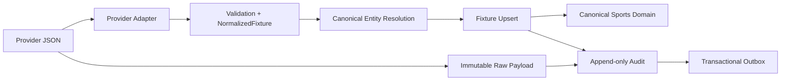

# 004 — Fixture Ingestion Pipeline

**Status:** Implemented in Phase 2.3.2  
**Scope:** Provider-neutral fixture ingestion only. Odds, statistics, feature engineering, and intelligence engines are intentionally out of scope.

## Purpose

Fixture data must be traceable from the original provider response to the canonical fixture that TITAN reads. The pipeline therefore separates provider vocabulary, raw evidence, canonical normalization, identity resolution, controlled mutation, audit records, and event publication.

## Boundaries

- `app/modules/ingestion/providers/` owns provider-specific request DTOs and mappings only.
- `app/modules/ingestion/schemas.py` defines the provider-neutral fixture contract.
- `CanonicalEntityResolver` maps external identities through ingestion-owned identity-link tables. It does not add provider IDs to Sports Domain tables.
- `FixtureIngestionService` owns idempotency, mutable-field rules, auditing, and outbox creation.
- Sports remains the canonical read model; no ingestion endpoint exposes raw provider JSON.

## Persistence and reproducibility

| Record | Purpose |
| --- | --- |
| `ingestion_fixture_runs` | Batch counts, provider, time range, and terminal status. |
| `ingestion_raw_fixture_payloads` | Immutable original JSON, SHA-256 checksum, validation result, and canonical fixture link. |
| `ingestion_*_provider_identities` | External-to-canonical IDs for fixtures and master data. |
| `ingestion_fixture_audit` | Append-only inserted, updated, unchanged, and validation-failed outcomes with field changes. |
| `ingestion_outbox_events` | Transactional messages for reliable later delivery. |

The idempotency key derives from the provider name and canonicalized JSON checksum. Replaying the same payload preserves the original receipt and appends an `unchanged` audit entry instead of creating a second fixture or event.

## Data-quality and mutation policy

- Unknown provider formats, bad timestamps, invalid IANA timezones, unknown status values, invalid seasons, duplicate officials, and impossible fixture times fail validation.
- Validation failures retain their raw payload and structured errors but roll back partial canonical entity creation.
- A known provider fixture cannot change `season_id`, `home_team_id`, or `away_team_id`.
- The explicit mutable whitelist is fixture status, venue, timezone, scheduled start/end, round, stage, and supplied official assignments.
- Status changes append to the existing canonical fixture-status history.

## Event policy

The transaction appends `FixtureIngested`, `FixtureUpdated`, or `FixtureValidationFailed` to the outbox. This phase intentionally does not implement a message-broker delivery worker; a later worker must claim unpublished rows, publish them, increment delivery attempts, and set `published_at` only after confirmed delivery.

## Adding a provider

Create an adapter implementing `FixtureProviderAdapter`, keep its provider DTOs in that adapter module, add it to application registry composition, and test the mapping. The core pipeline accepts only `NormalizedFixture`; provider-specific fields never require changes to the canonical models, resolver, service, or read API.
