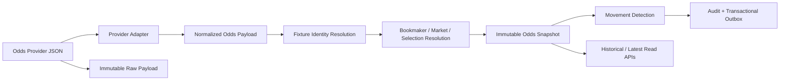

# 005 — Market Data & Odds Ingestion

**Status:** Implemented in Phase 2.3.3  
**Scope:** Immutable bookmaker odds history and market lifecycle ingestion. Statistical analysis, probability, consensus pricing, and recommendation logic are deliberately out of scope.

## Objective

TITAN preserves every meaningful source price observation as evidence. A current odds value alone cannot explain market movement, opening/closing prices, provider behavior, volatility, or later research conclusions. The Market Data bounded context therefore records raw payloads, normalized market structures, immutable snapshots, movements, audit results, and transactional events separately.

## Canonical model

| Entity | Responsibility |
| --- | --- |
| `Bookmaker` | Provider-neutral bookmaker identity. |
| `MarketType` | Extensible taxonomy; seeded common types are data, not hardcoded schema. |
| `MarketStatus` | Configurable lifecycle taxonomy: open, suspended, closed, settled. |
| `Market` | Fixture/type/period/line identity and current observed status. |
| `Selection` | Durable outcome identity; removed selections remain available for replay. |
| `OddsSnapshot` | Immutable price observation with full provenance. |
| `OddsMovement` | Append-only price, closing, suspension, reopening, and selection lifecycle evidence. |
| `MarketProviderMapping` | External ID to canonical ID mapping without provider fields in canonical tables. |
| `RawOddsPayload`, `OddsIngestionRun`, `OddsAudit` | Raw evidence and operational/audit lineage. |
| `MarketDataOutboxEvent` | Transactional event staging for reliable later delivery. |

## Immutability and idempotency

`OddsSnapshot` is append-only. It contains provider, bookmaker, fixture, market, selection, decimal odds, implied probability, source observation time, ingestion run, raw payload, and checksum. No service or API exposes an update operation for it.

The raw receipt idempotency key is the provider name plus a deterministic SHA-256 checksum of canonicalized JSON. Replaying the same payload cannot duplicate snapshots or events. Equal prices in a genuinely new payload are intentionally counted as ignored rather than generating false market movement.

## Movement semantics

- First observed selection price: `opening`.
- Greater decimal odds: `price_increased`; lower decimal odds: `price_decreased`.
- `suspended` and `open` status transitions: market suspension/reopening movements plus events.
- Transition to `closed`: closing movements reference the latest known price for each included selection.
- A full provider market view with an absent previously active selection: `selection_removed`; its canonical selection and all past snapshots remain intact.
- Reintroduced selection: `selection_added`.

Provider selection availability is tracked through provider mappings. One provider omitting a selection does not erase the selection or another provider's active view.

## Future Market Intelligence support

The bounded context delivers the historical evidence required by later modules without making analytical conclusions itself:

- opening/closing price calculations;
- time-series movement and volatility measures;
- bookmaker-specific behavior and availability analysis;
- multi-provider consensus construction;
- historical replay with the exact raw source and canonical mapping used at the time.

Those modules must consume immutable snapshots and movements, not overwrite or reinterpret their source history in place.
