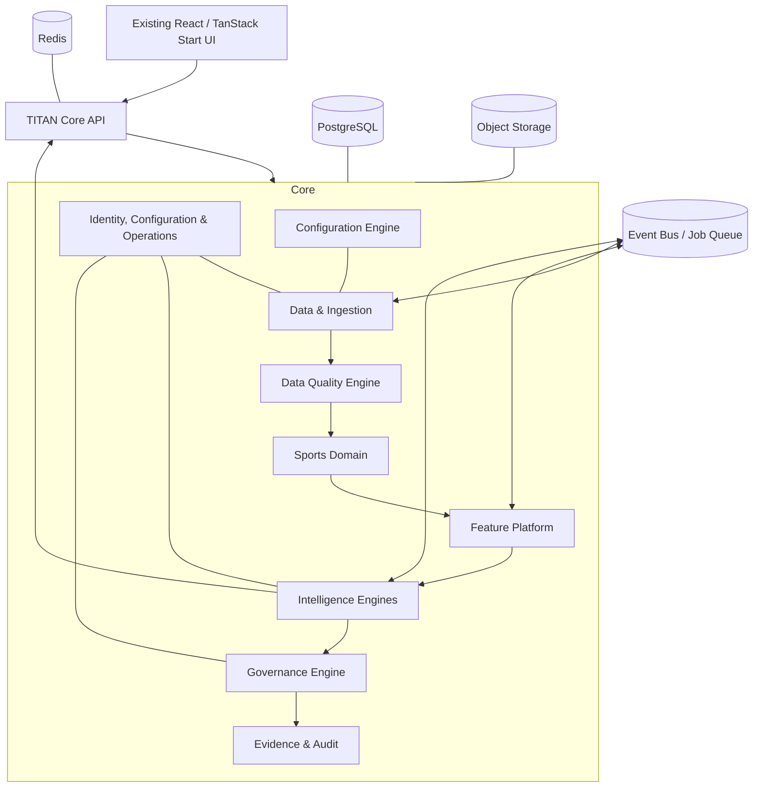

# TITAN OS — Phase 2 Architecture Review

**Status:** Proposed  
**Scope:** Backend and Core Platform architecture  
**Frontend impact:** None; the existing UI is preserved

## Executive summary

The repository is a strong Phase 1 frontend foundation: React 19, TanStack Start with server-side rendering, a cohesive application shell, a mature component library, accessibility work, data-display components, and 21 intelligence-oriented routes.

Phase 2 should introduce TITAN Core behind this existing presentation layer. The system must prioritize evidence, repeatability, and scientific evaluation over producing a large volume of recommendations.

The initial architecture should be a **modular core platform**, not a fleet of independently deployed microservices. One FastAPI application and one worker application can enforce clear internal boundaries while avoiding premature distributed-system complexity. A module may later become a separate service only when scale, team ownership, or deployment needs justify it.

> TITAN must never publish a recommendation unless it can also produce a complete evidence package explaining how that result was produced.

## Current repository assessment

### Assets to preserve

- File-based TanStack Start routes in `src/routes/`.
- The global shell, navigation taxonomy, themes, keyboard support, and accessibility behavior in `src/components/titan/AppShell.tsx`.
- Reusable TITAN components in `src/components/titan/`, including tables, timelines, confidence widgets, primitives, and charts.
- TanStack Query, already installed and suitable as the frontend server-state standard.
- Existing server-side rendering error handling in `src/start.ts` and `src/server.ts`.
- The existing visual design, routes, user experience, and branding.

### Current gaps

- No backend business domain, database, authentication, API client, or external data source exists yet.
- The application currently renders static placeholder data for matches, odds, engine health, alerts, research, reports, and dashboard metrics.
- TanStack Query is installed but not currently used to retrieve server data.
- The backtesting demonstration uses `Math.random()`. Production simulations must be deterministic and record a random seed if stochastic processes are necessary.
- There is no test-suite, data contract, migration framework, or environment configuration for a production backend.

The frontend is a presentation layer, not a source of truth. Placeholder arrays must not become accidental API contracts.

## Architecture principles

1. **Reproducibility by design.** Every output can be recreated using immutable input snapshots, versions, configuration, and model lineage.
2. **Immutable history.** Never overwrite historical source data, odds, feature values, model artifacts, or published decisions.
3. **Explicit ownership.** Each module owns its data and public contract.
4. **Independent evaluation.** Training, promotion, and evaluation must be separate processes and use temporally valid holdout data.
5. **Risk-aware abstention.** The system may withhold a recommendation when inputs are stale, incomplete, inconsistent, or out of distribution.
6. **Observable operations.** Logs, metrics, traces, health, job history, and audit entries are required features.
7. **Evolve by evidence.** Add models and services only after a measured, reproducible baseline exists.

## Proposed system architecture



### Initial deployment shape

| Component | Responsibility |
| --- | --- |
| Existing frontend | Presentation, client navigation, visualization, user interaction |
| TITAN Core API | Authentication, authorization, read/write APIs, OpenAPI contract |
| Worker application | Ingestion, feature generation, model runs, research, backtests, reports, evaluations |
| PostgreSQL | Canonical records, metadata, audit trail, model registry state, time-series metadata |
| Redis | Cache, rate limiting, idempotency, task coordination; not permanent truth |
| Object storage | Raw payloads, model artifacts, feature matrices, reports, evidence files |
| Event bus / job queue | Reliable asynchronous delivery and background-task scheduling |

## Recommended repository structure

```text
titan-sports-intelligence/
  src/                         # Existing frontend; preserve
  public/                      # Existing frontend assets; preserve

  backend/
    app/
      main.py                  # FastAPI composition root
      api/
        v1/
          routers/
          dependencies.py
      core/
        config.py
        security.py
        logging.py
        errors.py
        observability.py
      modules/
        identity/
        sports/
        ingestion/
        market_data/
        feature_store/
        research/
        probability/
        consensus/
        risk/
        explainability/
        recommendations/
        backtesting/
        evaluation/
        reporting/
        notifications/
        audit/
      shared/
        contracts/
        events/
        persistence/
        storage/
        idempotency/
      workers/
        tasks/
        schedules/
      tests/
        unit/
        integration/
        contract/
        e2e/
    alembic/
    pyproject.toml
    Dockerfile

  infra/
    compose/
    database/
    monitoring/
  docs/
    architecture/
    adr/
    api/
    data-contracts/
```

Each domain module should contain its own domain logic, application use cases, infrastructure adapters, API surface, tests, and migrations where appropriate. Avoid a global `models/`, `services/`, and `repositories/` arrangement that obscures ownership.

## Module catalog

| Module | Responsibilities | Principal outputs |
| --- | --- | --- |
| Identity | Users, organizations, roles, sessions, permissions | Authenticated principal and access decisions |
| Configuration | Feature flags, thresholds, league and bookmaker settings, model weights, risk policies, calibration settings, scheduler intervals | Versioned, approved runtime configuration |
| Sports | Competitions, teams, fixtures, results, canonical timeline | Canonical match records |
| Ingestion | Provider adapters, validation, normalization, provenance, raw payload archival | Validated domain events |
| Data Quality | Missing values, duplication, schema and timestamp validation, outliers, provider health, freshness, completeness scoring | Quality assessment and pass/fail gate decision |
| Market Data | Bookmakers, market taxonomy, odds snapshots, line movement | Price history and market signals |
| Feature Store | Feature definitions, validation, values, snapshots, lineage | Versioned feature sets |
| Research | Comparable matches, research runs, analyst notes, evidence retrieval | Research artifacts |
| Knowledge Base | Searchable patterns, market behaviour, league notes, model observations, research reports, provenance and access controls | Curated, searchable organizational knowledge |
| Experiment | Dataset and feature versions, parameters, metrics, comparisons, winner selection, promotion proposals | Reproducible experiment record |
| Model Registry | Model identity, artifact and feature lineage, training metadata, calibration, metrics, lifecycle and environment status | Governed model inventory and promotion state |
| Probability | Model execution, calibration, uncertainty, model registry integration | Model probability distributions |
| Simulation | Monte Carlo execution, scenario analysis, assumptions, random seeds and simulation outputs | Scenario distributions and simulation evidence |
| Consensus | Ensemble weighting, correlation checks, agreement and disagreement | Consensus prediction |
| Risk | Data-quality checks, uncertainty, correlation, out-of-distribution checks | Risk assessment or abstention |
| Governance | Final publication policy: validates quality gates, required evidence, calibration standards, risk policy, mandatory checks and approval rules | Publish or withhold decision with reasons |
| Explainability | Attribution generation and evidence assembly | Human-readable evidence package |
| Recommendations | Policy-controlled decision publication | Auditable recommendation or withholding decision |
| Backtesting | Point-in-time historical replay and strategy simulation | Immutable backtest run |
| Evaluation | Calibration, Brier score, log loss, drift, performance comparison | Evaluation report |
| Reporting | Report generation and export lifecycle | Versioned report artifacts |
| Notifications | Alert policy and delivery | User-facing alerts |
| Audit | Append-only record of key actions and decisions | Reproducibility ledger |

## Required decision flow

```text
Provider data snapshot
  → validation and provenance
  → data quality gate
  → canonical sports and market records
  → versioned feature snapshot
  → individual model runs
  → calibrated probabilities
  → simulations and scenario analysis, where applicable
  → consensus calculation
  → risk assessment
  → governance publication gate
  → evidence package
  → recommendation or documented abstention
```

No module may bypass this flow for a published recommendation without a documented architecture decision.

### Governance publication gate

Governance is intentionally distinct from the intelligence engines. Intelligence modules may produce analytical results; only the Governance Engine may permit a result to be published as a recommendation.

Before publication, Governance verifies:

- Required data-quality thresholds have passed.
- Required evidence and provenance records are present.
- The selected model and calibration version are approved for the relevant environment.
- Calibration and evaluation standards meet configured minimums.
- Risk policy permits publication for the current uncertainty, correlation, and exposure state.
- No mandatory validation, policy, or configuration rule has failed.

When any condition fails, Governance produces a documented withholding decision. This result is a valid, observable output—not an exception or silent failure.

## Reproducibility and evidence contract

Every published decision requires a stable `decision_id` and an immutable evidence package containing:

- Source records, provider identifiers, and raw-payload references.
- `event_time`, `provider_published_at`, `observed_at`, and `ingested_at` timestamps.
- Dataset, feature-definition, and feature-snapshot versions.
- Model artifact, model code, calibration, consensus, and risk-policy versions.
- Configuration snapshot and configuration approval revision.
- Exact parameter values, configuration revision, and software build revision.
- Random seeds for every stochastic operation.
- Individual model outputs, confidence intervals, and consensus weights.
- Data quality, freshness, and uncertainty measurements.
- Supporting and conflicting evidence.
- Final recommendation or documented reason for withholding it.

## Data architecture

PostgreSQL is the authoritative transactional and metadata store. Object storage retains immutable raw payloads, model artifacts, large feature matrices, generated reports, and evidence files. Redis supports caching and coordination only.

### Data rules

- Archive raw provider payloads before or alongside normalization.
- Append corrections as new versions; do not alter historical odds or statistics in place.
- Track both the time a fact happened and the time TITAN could have known it.
- Version feature definitions separately from feature values.
- Partition high-volume time-series data, such as odds snapshots, by time and relevant provider or competition dimensions.
- Enforce inbound idempotency keys and deduplicate without losing raw provenance.
- Store model artifacts immutably. Promotion changes registry metadata rather than the artifact.

## API and event communication

The frontend should use only a versioned public API, initially rooted at `/api/v1`. It must not invoke engines directly or read storage databases.

### Public API style

- REST and OpenAPI for data retrieval, configuration, reports, and commands.
- Server-Sent Events for initial live odds, alert, job-status, and system-status updates.
- Asynchronous jobs for ingestion, feature generation, research, training, backtesting, report generation, and evaluations.
- Cursor pagination and time-bound querying for time-series resources.
- A standard error envelope, request ID, authorization checks, and idempotency support for mutations.

Example resources:

```text
GET  /api/v1/dashboard
GET  /api/v1/fixtures
GET  /api/v1/fixtures/{fixture_id}
GET  /api/v1/odds?fixture_id={fixture_id}
GET  /api/v1/recommendations
GET  /api/v1/recommendations/{decision_id}/evidence
POST /api/v1/research-runs
GET  /api/v1/backtests/{run_id}
GET  /api/v1/models/evaluations
GET  /api/v1/events/stream
```

### Internal domain events

```text
fixture.upserted.v1
fixture.result_recorded.v1
odds.snapshot_recorded.v1
data.quality_assessed.v1
feature.snapshot_created.v1
research.run_completed.v1
model.run_completed.v1
probability.calculated.v1
consensus.calculated.v1
risk.assessed.v1
evidence.package_created.v1
recommendation.published.v1
recommendation.withheld.v1
backtest.completed.v1
evaluation.completed.v1
```

All events require an event ID, schema version, correlation ID, causation ID, event timestamp, producer identity, and idempotency key.

Configuration changes, model promotion, experiment completion, quality-gate failure, and governance decisions must each emit an auditable versioned event.

## Configuration, model, and experiment governance

### Configuration Engine

All operationally meaningful settings must be versioned configuration, rather than hard-coded application constants. This includes feature flags, probability and publication thresholds, per-league settings, bookmaker settings, model and consensus weights, risk policies, calibration settings, and scheduler intervals.

Configuration changes require an author, timestamp, approval state, effective period, and audit record. A decision's evidence package must point to the exact configuration snapshot that was applied.

### Model Registry

Every registered model must retain at least:

```text
model_id
version
algorithm
artifact reference and checksum
training dataset version
training date
feature version
calibration version
evaluation metrics
status
environment (development, staging, production)
creator
```

Models are immutable once registered. Lifecycle state changes—such as candidate, staging, approved, deprecated, or retired—are recorded independently from the artifact.

### Experiment Engine

Experiments are first-class research artifacts. Each experiment records:

```text
experiment_id
dataset version
features used
candidate model version or algorithm
parameters
evaluation protocol
metrics
winning candidate
promotion decision and approver
```

An experiment may recommend a model for promotion; the Model Registry and Governance Engine control whether it is approved for a target environment.

### Data Quality Engine

The Data Quality Engine is a mandatory gate before downstream feature, model, or recommendation workflows. It evaluates missingness, duplicate detection, outliers, timestamp validity, schema validity, provider health, freshness, confidence, and completeness.

Its output is a versioned quality assessment with individual check results, an aggregate score, threshold results, and a pass/fail decision. Failed records remain archived and auditable but cannot silently enter downstream decision workflows.

### Simulation Engine

The Simulation Engine owns Monte Carlo simulations and scenario analysis. It is distinct from the Probability Engine: probability estimation models the underlying outcome distribution, while simulation explores resulting outcomes under explicit assumptions and uncertainty.

Every simulation must store its scenario definition, input snapshots, algorithm version, parameter configuration, random seed, run timestamp, and output distribution.

### Knowledge Base

The Knowledge Base is a searchable repository for analyst-authored and system-generated research assets: patterns, market behaviours, league notes, model observations, experiment summaries, and research reports. Every entry requires provenance, ownership, timestamps, access controls, and version history. It must not be used as an unverified source of truth for live decisions; analytical claims need their original evidence references.

## Architecture Decision Records

Major architectural choices must be documented in `docs/adr/` as concise Architecture Decision Records (ADRs). An ADR includes context, the decision, alternatives considered, consequences, status, owner, and date.

Initial ADRs:

- **ADR-001:** Why FastAPI for TITAN Core?
- **ADR-002:** Why PostgreSQL as the authoritative transactional store?
- **ADR-003:** Why begin with a modular monolith?
- **ADR-004:** Why use asynchronous domain events and a job queue?
- **ADR-005:** Why preserve immutable odds and provider snapshots?
- **ADR-006:** Why is Governance the sole publication authority for recommendations?

## Frontend integration mapping

| Existing screen | Backend source |
| --- | --- |
| Dashboard | Dashboard read model |
| Matches, Leagues, Teams | Sports module |
| Live Odds, Market Intelligence, Arbitrage | Market Data, Risk, Recommendations |
| AI Intelligence | Model registry, Evaluation, operational telemetry |
| Value Analysis | Probability, Consensus, Risk, Recommendations |
| Research Workspace | Research runs and evidence artifacts |
| Backtesting, Performance | Backtesting and Evaluation |
| Timeline, Alerts | Audit events, domain events, Notifications |
| Reports | Reporting and Explainability |
| System Status | Observability read model |
| Account, Settings | Identity and configuration |

Mock data should be replaced incrementally with typed API clients and React Query hooks. Keep data-fetching code distinct from presentational components so the existing interface remains intact.

## Security and operations baseline

Before production data or models are used, establish:

- Organization-aware authentication and role-based authorization.
- Secret management outside source code and outside frontend bundles.
- Encryption in transit and at rest.
- Audit logging for data changes, model promotion, configuration changes, research runs, and decision access.
- Rate limits and isolation of provider credentials.
- Structured logs, metrics, distributed traces, health checks, and job-run history.
- Development, staging, and production environment separation.
- Backup/restore tests and retention policies.
- CI checks for linting, formatting, unit tests, integration tests, API contracts, migrations, dependency security, and build verification.

## Delivery roadmap

1. Approve this architecture, create architecture decision records, and define initial data contracts.
2. Create the backend scaffold with configuration, FastAPI, PostgreSQL, Redis, object storage, job queue, Docker Compose, and observability foundations.
3. Add identity, audit logging, database migrations, and canonical sports entities.
4. Deliver one auditable vertical slice: ingest fixtures from one source, validate and archive source data, persist canonical fixtures, expose a read-only API, and bind one existing frontend route to it.
5. Add odds snapshots, provenance, and market-data history.
6. Implement feature versioning and data-quality controls.
7. Implement Configuration, Model Registry, and Experiment foundations before production model promotion.
8. Implement one deterministic probability baseline and independent evaluation.
9. Add Simulation, Consensus, Risk, Governance, Explainability, and the evidence package.
10. Add recommendations, backtesting, reporting, knowledge-base workflows, and live event streaming.
11. Introduce additional models only after the baseline is calibrated, reproducible, and independently validated.

## First implementation milestone

The first implementation milestone is not a full backend or an AI engine. It is an **auditable fixture-data vertical slice**:

1. Ingest one fixture data source.
2. Preserve its raw payload and provenance.
3. Normalize it into canonical sports records.
4. Store it with migrations and timestamps.
5. Expose it through a versioned, read-only API.
6. Replace the corresponding frontend placeholder data using a typed TanStack Query hook.

This validates the most important TITAN Core properties—module boundaries, data provenance, API contracts, operational visibility, and frontend integration—before model complexity is introduced.
